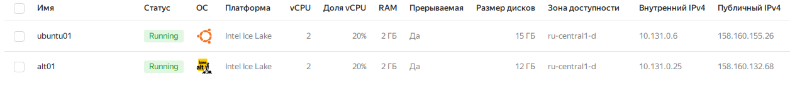
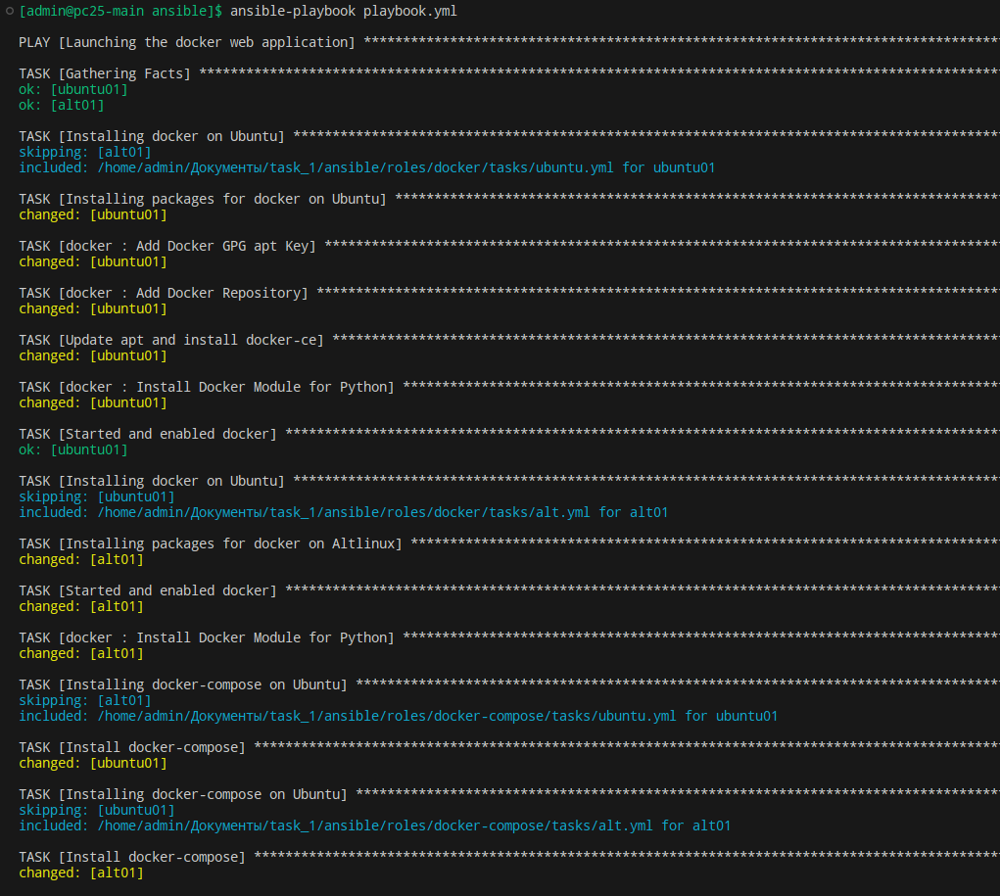
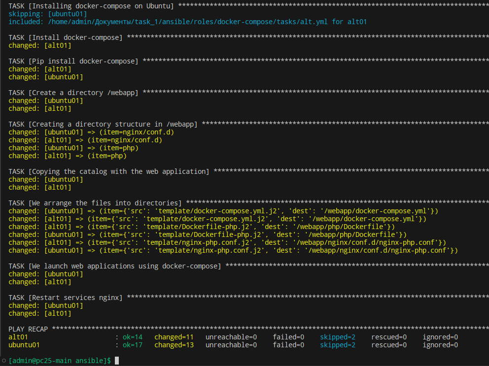
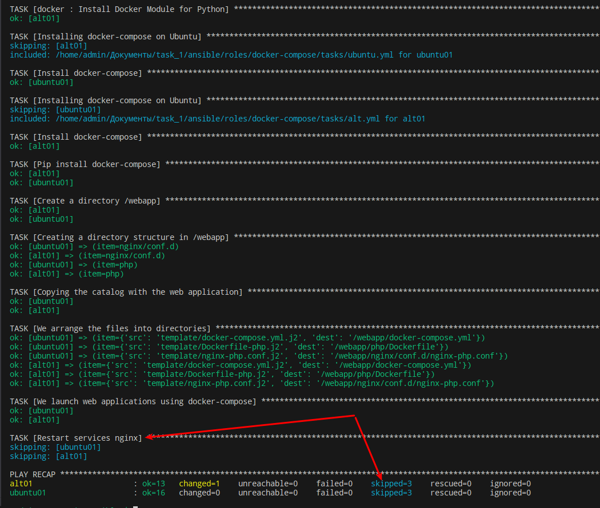
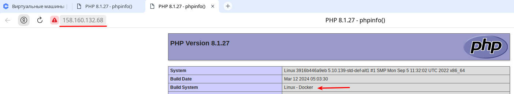
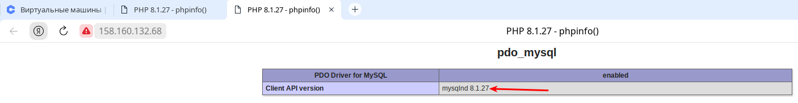
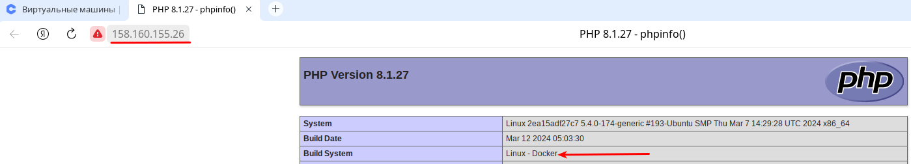
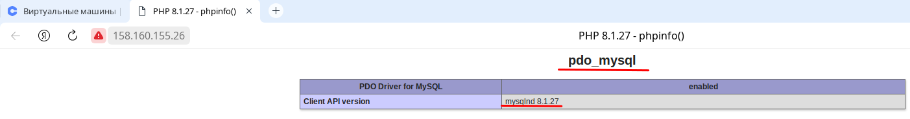

## Задача:

Разработать ansible, запускающий докеризированное веб приложение (nginx, php, mysql) с использованием docker-compose.yml на удалённом сервере.
Плейбук должен

1. Дистрибьютить необходимые для работы файлы
2. Генерировать конфигурационный файл для nginx, и, по необходимости,
перезапускать его (nginx).

## Реализация: 

- Тестовые ВМ - развёрнутые в Yandex Cloud под ОС: ALT Linux 10 и Ubuntu 20.04



- Запуск "playbook":

```bash
ansible-playbook playbook.yml
```





### Идемпотентность:



*P.S. в случае если будет изменён файл шаблона "template/nginx-php.conf.j2" - то будет выполнена задача отчечающая за перезапуск контейнера с nginx, при повторном запуске playbook, но уже можно убрать из него роли по установке docke и docker-compose*

## Работоспособность:

- **alt01**:





- **ubuntu01**:




